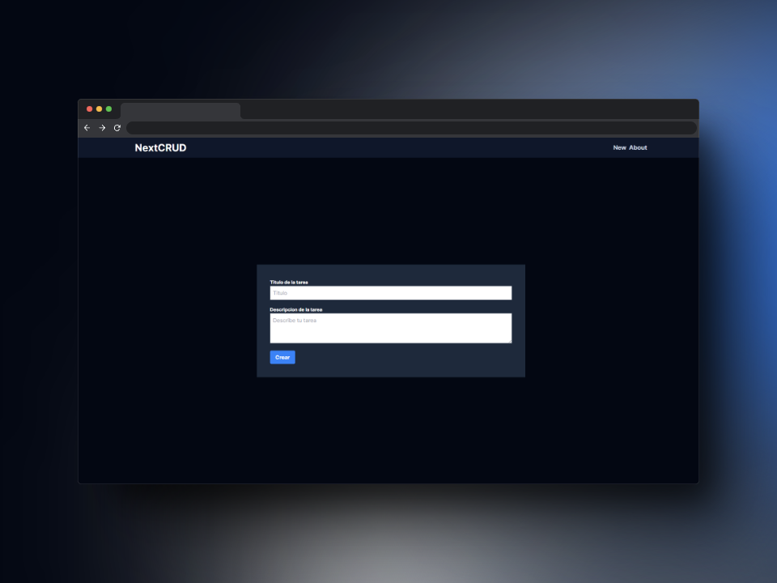

<!-- Please update value in the {}  -->

<h1 align="center">NextCRUD</h1>

<div align="center">
  <h3>
    <a href="https://{your-demo-link.your-domain}">
      Demo
    </a>
  </h3>
</div>

<!-- TABLE OF CONTENTS -->

## Table of Contents

- [Overview](#overview)
- [Built With](#built-with)
- [Features](#features)
- [How to use](#how-to-use)
- [Contact](#contact)
- [Acknowledgements](#acknowledgements)

<!-- OVERVIEW -->

## Overview




### Built With

<!-- This section should list any major frameworks that you built your project using. Here are a few examples.-->

- [NextJS](https://nextjs.org)
- [React](https://reactjs.org/)
- [TailwindCSS](https://tailwindcss.com)
- [SQLite](https://www.sqlite.org/index.html)
- [Prisma](https://www.prisma.io)

## Features

<!-- List the features of your application or follow the template. Don't share the figma file here :) -->

This app/site was created as a example of a nextjs course

## How To Use

<!-- Example: -->

To clone and run this application, you'll need [Git](https://git-scm.com) and [Node.js](https://nodejs.org/en/download/) (which comes with [npm](http://npmjs.com)) installed on your computer. From your command line:

```bash
# Clone this repository
$ git clone https://github.com/vaancillo/nextjs-prisma-crud.git

# Install dependencies
$ npm install
$ npm install -D tailwindcss
$ npm install prisma --save-dev

# Run the app
$ npm run dev
```
Open [http://localhost:3000](http://localhost:3000) with your browser to see the result.

You can start editing the page by modifying `app/page.jsx`. The page auto-updates as you edit the file.

## Acknowledgements

<!-- This section should list any articles or add-ons/plugins that helps you to complete the project. This is optional but it will help you in the future. For example: -->

To learn more about Next.js, take a look at the following resources:

- [Next.js Documentation](https://nextjs.org/docs) - learn about Next.js features and API.
- [Learn Next.js](https://nextjs.org/learn) - an interactive Next.js tutorial.

You can check out [the Next.js GitHub repository](https://github.com/vercel/next.js/) - your feedback and contributions are welcome!

## Contact

- GitHub [@vaancillo](https://github.com/vaancillo)
- Twitter [@jaredmazapann](https://twitter.com/jaredmazapann)